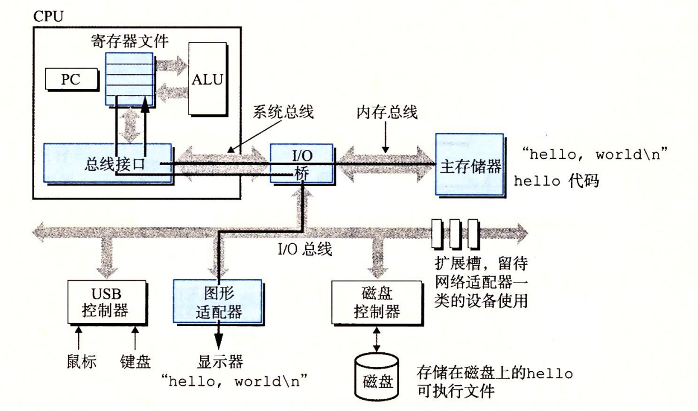

源程序hello.c -> 预处理器(cpp)hello.i -> 编译器(ccl)hello.s 生成汇编代码 -> 汇编器(as)hello.o -> 链接器(ld) -> 可执行目标程序

预处理：处理#include，告诉预处理器读取系统头文件的内容，并把它直接插入程序文本中

编译：生成汇编代码

汇编：将汇编代码翻译成机器语言指令，保存在目标程序中

连接：将调用的C函数库的目标文件(如printf.o)以某种方式合并到我们的hello.o程序中，链接就完成这种合并，结果得到hello文件（可执行目标文件）

> 现代计算机以存储器为中心设备